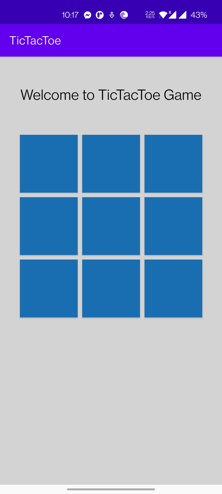
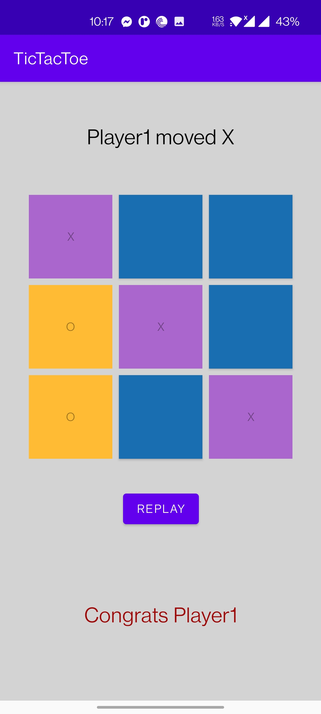
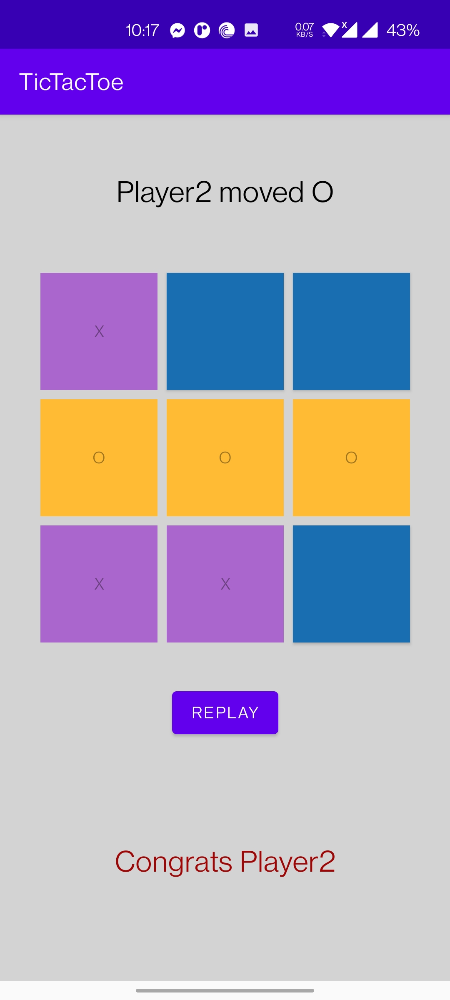

# TicTacToe App Android

Tic-tac-toe, noughts and crosses, or Xs and Os is a paper-and-pencil game for two players who take turns marking the spaces in a three-by-three grid with X or O. 
The player who succeeds in placing three of their marks in a horizontal, vertical, or diagonal row is the winner.

## Screenshots

## Authors

- [@omrtyyb](https://www.github.com/omrtyyb)

## 🔗 Links

## Badges

